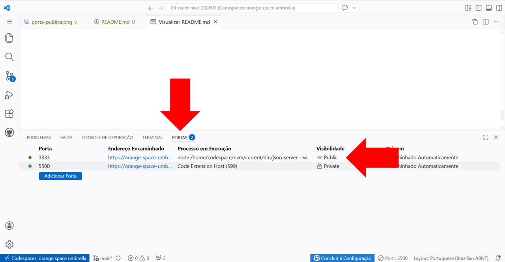
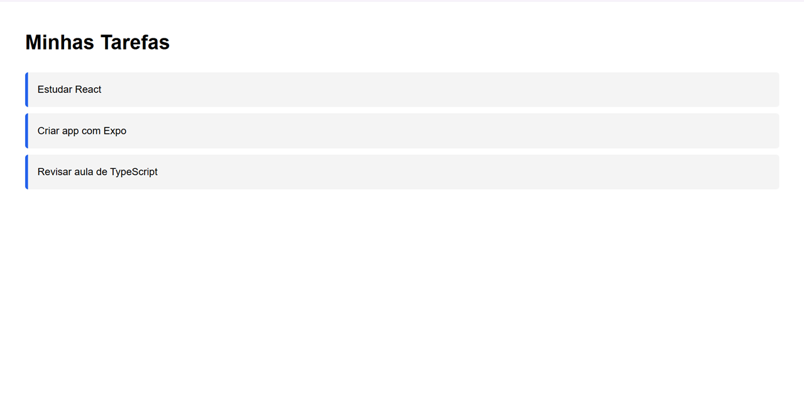

# Criar a pasta `server`.

# Criar o arquivo  `db.json` com o conteúdo abaixo:
```json
{
  "tarefas": [
    {
      "id": 1,
      "titulo": "Estudar React",
      "concluida": false
    },
    {
      "id": 2,
      "titulo": "Criar app com Expo",
      "concluida": true
    },
    {
      "id": 3,
      "titulo": "Revisar aula de TypeScript",
      "concluida": false
    }
  ]
}
```

# Executar o comando: 
`
npm install -g json-server --save
`

# Executar o comando: 
`
json-server --watch db.json --port 3333
`

# Na aba `PORTAS` do terminal do `VS Code` do `Codespaces`, alterar a visibilidade da porta para `Public`.


# Realizar um teste com o arquivo `index.html` da pasta `teste`.

